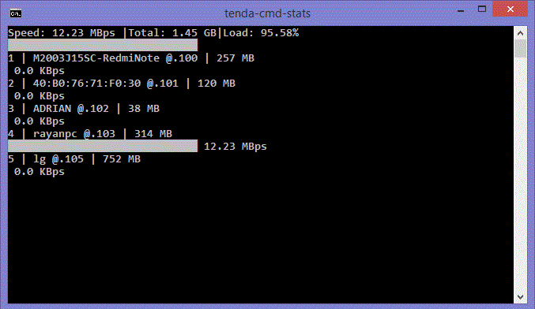

## Simple Cmd-line dashboard app for `Tenda n301 V5.07.56.1` Routers.

### Cmd-line Dashboard 


### Run On Windows
`run.bat`

### `Api`
```python
import api

resp = api.getAllStatsJson()
print(resp)
```
### Response
```json
[
    {
        "ip":"192.168.0.100",
        "upKB":0.1,
        "downKB":0.1,
        "sentMsg":508159.0,
        "sentMB":50.3,
        "recievedMsg":2104774.0,
        "recievedMB":2307.6,
        "name":"M2003J15SC-RedmiNote",
        "mac":"2A:52:73:F1:FE:53",
        "jank":"0",
        "leaseTime":85656.0
    },
    {
        "ip":"192.168.0.101",
        "upKB":0.0,
        "downKB":0.0,
        "sentMsg":1175740.0,
        "sentMB":82.0,
        "recievedMsg":2047824.0,
        "recievedMB":3005.6,
        "name":"ADRIAN",
        "mac":"32:BC:8F:40:C8:B8",
        "jank":"0",
        "leaseTime":65465.0
    },
    {
        "ip":"192.168.0.102",
        "upKB":0.0,
        "downKB":0.0,
        "sentMsg":369219.0,
        "sentMB":36.5,
        "recievedMsg":812569.0,
        "recievedMB":1095.8,
        "name":"192.168.0.102",
        "mac":"40:B0:76:71:F0:30",
        "jank":"0",
        "leaseTime":56779.0
    },
    {
        "ip":"192.168.0.103",
        "upKB":0.0,
        "downKB":0.0,
        "sentMsg":2921760.0,
        "sentMB":3721.5,
        "recievedMsg":2220850.0,
        "recievedMB":1992.4,
        "name":"rayanpc",
        "mac":"14:18:77:B2:69:F4",
        "jank":"0",
        "leaseTime":47768.0
    },
    {
        "ip":"192.168.0.104",
        "upKB":0.0,
        "downKB":0.0,
        "sentMsg":120878.0,
        "sentMB":101.2,
        "recievedMsg":186554.0,
        "recievedMB":201.5,
        "name":"POCOM2Pro-POCOM2Pro",
        "mac":"E0:1F:88:23:C4:92",
        "jank":"0",
        "leaseTime":85222.0
    },
    {
        "ip":"192.168.0.105",
        "upKB":0.0,
        "downKB":0.0,
        "sentMsg":574971.0,
        "sentMB":41.3,
        "recievedMsg":1349381.0,
        "recievedMB":1347.9,
        "name":"lg",
        "mac":"90:00:4E:91:54:5D",
        "jank":"0",
        "leaseTime":81015.0
    },
    {
        "ip":"192.168.0.106",
        "upKB":0.0,
        "downKB":0.0,
        "sentMsg":68224.0,
        "sentMB":9.4,
        "recievedMsg":290257.0,
        "recievedMB":390.4,
        "name":"M2006C3MI-POCOC3",
        "mac":"9C:28:F7:C6:47:AA",
        "jank":"0",
        "leaseTime":78845.0
    },
    {
        "ip":"192.168.0.109",
        "upKB":3.8,
        "downKB":266.4,
        "sentMsg":201677.0,
        "sentMB":12.8,
        "recievedMsg":1253225.0,
        "recievedMB":1800.1,
        "name":"osmc",
        "mac":"B8:27:EB:DF:C9:F8",
        "jank":"0",
        "leaseTime":85071.0
    },
    {
        "metrics":{
            "totalDownKB":266.5,
            "totalUpKB":3.9,
            "totalSpeed":270.4,
            "totalSentMB":4055.0,
            "totalRecievedMB":12141.3
        }
    }
]
```


